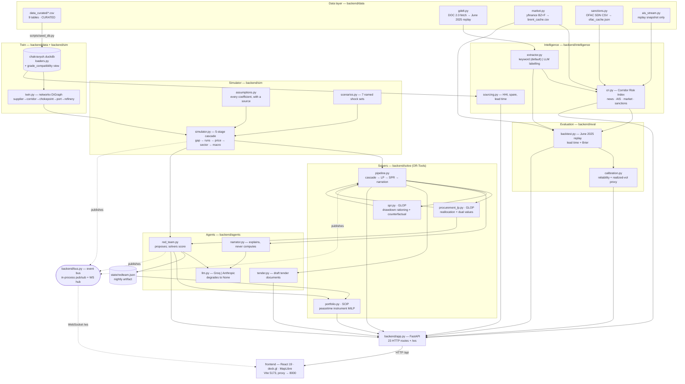

# CHAKRAVYUH — Architecture

This document describes how the system is put together, which invariants the code enforces, and the exact formulation of each optimisation. Every claim here is checkable against the file named beside it.

---

## 1. Components



The event bus is the reason the UI can show the pipeline *running* rather than freezing and then dumping an answer. `solve/pipeline.py` publishes `pipeline.start`, `pipeline.cascade`, `pipeline.procurement`, `pipeline.spr`, `pipeline.narration` and `pipeline.complete` as each stage finishes, each with an elapsed-ms figure timestamped at publish time, not at render time. `bus.py` keeps a 400-event ring buffer and replays the last 60 to a client on connect, so a late joiner is not blind; `/api/events` exposes the same history over HTTP.

---

## 2. The two non-negotiable design rules

### Rule 1 — the honesty legend

*Nothing simulated is ever presented as live, and the claim degrades when the evidence does.*

**How the code enforces it.**

* The vocabulary exists exactly once, in `backend/config.py`: `Provenance.LIVE | CURATED | REPLAY | SIMULATED | INJECTED`, with labels and colours beside it. Adding a data source means adding its tag there first.
* Every payload that crosses the API boundary carries `provenance`. Not just the envelope — individual records do too: each twin node and edge (`twin.to_geojson_like`), each corridor path and flow arc (`app.network`), each vessel and each anomaly (`ais_stream.vessel_snapshot`), each extracted event, each supplier disruption probability. `scripts/smoke_test.py` asserts this for network nodes and vessels.
* **Feeds tag themselves, and never relabel on the way out.** `market.py` returns LIVE for a successful `yfinance` fetch, REPLAY for the cache, and `available: false` rather than a fabricated price when it has neither. `gdelt.py` returns LIVE only for a successful DOC 2.0 call and REPLAY for anything read from the archive, "not even partially" relabelled. `sanctions.py` behaves the same way. The API's TTL cache in `app.py` stores whatever the feed layer returned *including its tag*, so a cached LIVE payload stays LIVE for its TTL and then re-fetches — it is never re-stamped.
* **A missing key downgrades the claim.** `/api/legend` returns an `active` map alongside the five entries. `active[LIVE]` is `AIS_ENABLED`, i.e. it is false unless a key exists, so the legend cannot assert a live class the deployment has not earned. The extractor's LLM path is likewise not silently assumed: the CRI payload reports `extraction_method: "keyword" | "llm+keyword"`.
* **An unavailable signal is dropped, not scored zero.** When OFAC is unreachable with no cache, `sanctions.sdn_delta()` returns `available: false`, `cri.score_corridors` passes `None` for that class, its weight is removed and the remainder renormalised, and both `weights` (nominal) and `weights_effective` (actually used) are returned per corridor along with `unavailable_signals`. Scoring a missing signal as zero would read as "no risk here", which is a different and false claim.
* **Even a present key does not buy a label.** `ais_stream.vessel_snapshot()` serves the replay snapshot and says so in plain text even when `AISSTREAM_API_KEY` is set, because no live reader is wired into this build. The smoke test asserts `provenance != "live" or live_ais_configured`.

### Rule 2 — the solver decides, the LLM narrates

*No number that reaches the UI was produced by a language model.*

**How the code enforces it.**

* `backend/agents/llm.py` is the only module that talks to a provider, and its contract is stated at the top: "The LLM never decides anything numeric. Callers pass solver output in and get prose or structured labels back. Nothing in this module computes a barrel, a price, or a cost." Every call path degrades to `None` on any exception, and the caller falls back to a deterministic path.
* **`narrator.py` is forbidden from computing.** Its system prompt says "You do NOT make decisions and you do NOT compute anything. Every figure you cite must appear verbatim in the data you were given. If a number is not in the data, do not state it." The `_facts()` function assembles a fixed brief from the cascade headline, the LP lines, the named binding constraints and the SPR plan; that string is the model's entire universe. With no key, `_fallback()` renders the same numbers through a deterministic template, and the payload reports `mode: "deterministic"` so the UI can say which ran.
* **`red_team.py` scores with the real cascade and LP, not with model assertions.** `score_attack()` runs `run_cascade()` and `solve_procurement()` and derives damage as *residual* — the cascade's total cost multiplied by `1 - coverage_pct/100`, floored at 5%. An attack the procurement LP absorbs scores near zero no matter how dramatic the model's description of it. The tool result handed back to the model even says so: `"note": "damage is residual after our best defense runs"`.
* **The agent has to beat a floor.** `search_baseline()` always runs — an exhaustive sweep over every chokepoint at three severities and two durations, the six largest suppliers at two severities, and 45 seeded random two-vector combinations. The LLM's best result replaces the sweep's only if `agent_best.damage_per_dollar > best.damage_per_dollar`; otherwise `found_by` is `"baseline_search"` and the agent's prose is kept only as rationale.
* **Model tool arguments are clamped before they run.** `coerce_attack()` rejects an unknown `kind`, resolves `target` against the real id lists (with a case-insensitive retry) and rejects it if there is no match, and normalises severity: *models routinely emit `60` meaning 60%*, so anything `> 1.0` is divided by 100, then clamped to `[0.05, 1.0]`. Duration is coerced to an int and clamped to `[1, 180]`. A proposal that costs more than the budget is rejected with an explanatory string rather than executed. The extractor applies the same distrust to labelling output: `_coerce()` clamps severity and confidence into `[0, 1]`, validates `corridor_affected` against the enum, truncates free-text fields to 80 characters, and falls back to the keyword result field by field.
* **The index is deterministic by default.** `extract_events(use_llm=False)` is the default for the CRI and is what the backtest always uses, because "an index that changes because a language model felt different today is not an index". `/api/cri?llm=true` is opt-in and only enriches the eight most recent headlines.
* **The tender is assembled in Python.** `build_tender()` and `render_text()` are pure and deterministic; the model may write only a ≤90-word covering note, and if it is unavailable `cover_note_mode` is `"omitted"` and the documents are unchanged.

---

## 3. The procurement LP (`backend/solve/procurement_lp.py`)

Solved with OR-Tools **GLOP** (continuous), 10-second time limit. Volumes are in thousands of barrels (kb); costs in USD/bbl, so an objective coefficient times a variable yields thousands of dollars.

### Decision variables

| Variable | Domain | Meaning |
|---|---|---|
| `x[s, r, v, w]` | `≥ 0` | kb of crude from supplier `s` to refinery `r` on vessel class `v`, **fixed** in week `w`. |
| `u[r, w]` | `≥ 0` | Cumulative shortfall at refinery `r` still open at the end of week `w`. |

The horizon is `W = max(4, ceil(duration_days / 7))` weeks. An `x` variable is only created when *all* of the following hold — the variable set is itself a physical filter:

1. a curated route exists for `(s, discharge port, v)`;
2. at least one modelled refinery sits behind that discharge port;
3. the supplier's region maps to a tanker pool that actually has hulls of class `v` (`solve/regions.py`) — without this the solver quietly routes around every tonnage constraint by chartering a class nobody counted hulls for;
4. `(r, s)` is grade-compatible in the `grade_compatibility` view (API gravity inside the refinery's band **and** sulfur at or below its maximum);
5. refinery `r` has a positive gap from the cascade;
6. the cargo lands inside the horizon: `w + (voyage_days + reroute_lag_days)/7 ≤ W`.

`u` is a genuine slack variable with a price, not an infeasibility. A plan that cannot fully close the gap is still the best available plan, and the operator needs to see how much is left uncovered.

### Constraints

| Class | Form | Rationale |
|---|---|---|
| **Demand (cumulative)** | For each `r`, `w`: `Σ{x[s,r,v,w'] : deliver_week ≤ w} + u[r,w] ≥ 7·gap_kbd[r]·(w+1)` | See below. |
| **Liftability** | For each `s`, `w`: `Σ x[s,·,·,w] ≤ 7 · max(0, max_liftable_kbd − baseline_kbd) · (1 − blocked_frac[s])` | Only spare capacity is for sale, and a supplier the shock has blocked cannot sell its way out of it — this is what stops the solver "solving" a Hormuz closure by buying more Basrah. |
| **Tanker tonnage** | For each `(pool, class, w)`: `Σ x / cargo_size_kb ≤ vessels_available_30d · 7/30` | Prompt hulls are finite. Dividing by cargo size converts volume into vessel count; the 30-day prompt list is spread across weeks. |
| **Berth capacity** | For each discharge port, `w`: `Σ{x : lands in week w} ≤ berth_capacity_kbd · 7` | A port can only discharge so much per week regardless of what is fixed. |

**Why demand is cumulative.** A per-week demand constraint would let the solver deliver everything in the last week and still call the gap closed. Instead, by the end of week `w` the refinery has needed `(w+1)` weeks of crude and can only have received cargoes that actually landed by then; anything still missing appears as `u[r, w]`. Because the objective penalises `u` in **every** week it remains open, the objective becomes a genuine days-of-cover shortfall: *a barrel that is three weeks late costs three times a barrel that is one week late.* Two figures come out of this and mean different things — `unmet_kb` is `u` in the final week only (barrels never delivered), and `shortfall_barrel_weeks` is `Σ u` across all weeks (the days-of-cover penalty). Summing every week to report a volume would count the same missing barrel once per week.

### Objective

```
minimise   Σ  unit_cost[s,v,port] · x[s,r,v,w]   +   250 · Σ u[r,w]

unit_cost  =  82.0                          base crude, USD/bbl
            + spot_premium_usd_bbl[s]       curated, per grade
            + freight[route_family, v]      curated, USD/bbl
            + 0.45 if port is east coast    extra leg around Sri Lanka
```

`UNMET_PENALTY_USD_BBL = 250` sits well above any physical procurement cost, so the solver exhausts every real option before accepting a shortfall — while still preferring a small shortfall to an absurdly expensive cargo. `cost_delta_usd_mn` reports the *premium over baseline crude*, not the whole oil bill.

### Why binding constraints come from dual values

We solve a continuous LP rather than an integer program deliberately. Barrels are near-continuous at this scale, and the LP relaxation buys us **dual values**, which is the only honest way to name what is limiting the plan.

A non-zero dual on a constraint means relaxing it by one unit would improve the objective — that constraint, not "supply" in general, is what is holding the plan back. `_binding_constraints()` reads `ct.dual_value()` for every named constraint, discards magnitudes below `1e-6`, sorts by absolute shadow price, collapses the same constraint repeated across weeks into one line, and returns the top 5 with a human sentence:

* `tanker_*` → "Limited by VLCC availability out of Arabian Gulf, not by crude supply."
* `lift_*` where the supplier is disrupted → "Basrah Medium is 50% blocked by the disruption itself — the barrels exist but cannot move." (distinguishing "the market is tight" from "we did this to them")
* `lift_*` otherwise → "Limited by how much X is actually for sale."
* `berth_*` → "Limited by discharge capacity at Sikka."
* `demand_*` → **excluded**: the demand dual is the shadow price of the gap itself, not a resource limit.

This is what lets the narrator say "limited by VLCC availability" and mean it, rather than guessing from the shape of the answer.

---

## 4. The peacetime portfolio MILP (`backend/solve/portfolio.py`)

Solved with OR-Tools **SCIP**, 10-second time limit. Input is the set of attacks the red team actually measured (best attack first, then the top of the baseline sweep, capped at 6).

```
minimise   Σ_i cost_i · x_i  −  Σ_k p_k · damage_k · m_k

s.t.       m_k          ≤ ceiling_k                    physical limit
           Σ_i c_{i,k}  ≥ m_k                          only what was bought
           c_{i,k}      ≤ mitigation_{i,k} · x_i       per-unit delivery
           c_{i,k}      ≤ ceiling_k · 0.40             diversification cap
           Σ_i cost_i · x_i ≤ budget                   default $220 mn
           x_i ∈ ℤ ∩ [0, max_units_i]
           m_k ∈ [0, ceiling_k],  c_{i,k} ≥ 0
```

`m_k` is the fraction of attack `k`'s damage neutralised. Because the objective rewards larger `m_k`, the solver drives each `m_k` to the smaller of its ceiling and the mitigation actually purchased — which is how a `min()` encodes correctly in a linear program. Attack probabilities are `p_k = 0.12 · dpd_k / max(dpd)`, scaled from damage-per-dollar on the reasoning that the cheapest attacks are the likeliest to be attempted; damage is converted from $bn to $mn so cost and loss share a unit.

Nine instruments are defined, each with an annualised unit cost, a maximum holding, and a mitigation vector keyed by attack *kind* and, where the mechanism is specific, by *chokepoint*. The keying is physical, not cosmetic: Fujairah storage counters `HORMUZ` specifically because Fujairah sits **outside** the strait, and contributes nothing against a Cape re-routing. Rotterdam counters `BAB` and `SUEZ`. VLCC and Suezmax options attack the tanker-availability constraint that binds the procurement LP.

### The two caps, and why both exist

**`MAX_MITIGATION = 0.45`, scaled by severity.** `_ceiling(attack) = 0.45 · (1 − 0.4 · worst_severity)`. A partial restriction leaves re-routing options that money can exploit; a total closure does not. A 100% chokepoint closure therefore caps at **0.27** — even a perfect portfolio absorbs about a quarter of the damage and the rest is simply borne.

**`SINGLE_INSTRUMENT_CAP = 0.40`.** No single instrument may supply more than 40% of one attack's achievable mitigation, enforced through the per-instrument contribution variables `c_{i,k}`.

Both exist because of what happened without them. Absent the ceiling, the optimiser cheerfully reported **100% neutralisation of a fully closed Strait of Hormuz** — financial instruments undoing physics. That single number would discredit every other output in the system: if the Strait is closed, 43% of India's imports stop moving and no quantity of charter options changes that. Absent the per-instrument cap, the optimiser found the cheapest generic instrument, bought the maximum of it, saturated the ceiling and stopped — a purchase order, not a portfolio. Concentration risk applies to hedges too.

Both caps are disclosed in the payload (`ceiling_note`, `probability_note`) and `per_attack` reports `neutralised_pct` beside `max_mitigable_pct`, so a reader can see the constraint binding. `scripts/smoke_test.py` asserts that no attack is ever reported above 45.1% neutralised.

---

## 5. The Corridor Risk Index (`backend/intelligence/cri.py`)

One 0–100 score per corridor, per day. The weighting is stated in the module docstring, returned in every payload as `weights`, and accompanied by `weighting_rationale` — because a risk index whose weights you cannot see is a horoscope.

| Signal | Weight | Rationale |
|---|---|---|
| News / GDELT events | **0.35** | Leads. Shipowners reprice on headlines hours before anything is observable on the water, so it gets the largest single weight. |
| AIS behavioural anomalies | **0.25** | Confirms. Slower, but it is behaviour rather than talk — it is what turns a scary headline into a real transit disruption. A close second by design. |
| Market stress (Brent) | **0.25** | Deliberately *not* dominant. Brent is the thing the index is trying to lead; an index that mostly reads the price will always appear to have "predicted" a move it merely echoed. |
| Sanctions activity | **0.15** | Smallest, because it moves in discrete administrative steps rather than continuously — but it is the signal that persists after the headlines fade. |

Each sub-score is 0–100 and documented at its own source:

* **news** — `load = Σ severity · (0.5 + 0.5·confidence) · 0.5^(age/3 days)`, then `score = 100·(1 − e^(−load/2.5))`. Confidence modulates rather than multiplies out: a low-confidence extraction of a severe event is still evidence, just weaker. Events the extractor could not pin to a corridor still count against every corridor at a 0.2 spillover factor — a global escalation is not zero risk anywhere.
* **ais** — weighted anomaly load per corridor over a saturation anchor of 6.0 (`ais_stream.anomaly_score_by_corridor`); dark-near-chokepoint weighs 1.0, anchorage cluster 0.8, loitering 0.6.
* **market** — `100 · clip(0.55·vol30/45 + 0.45·max(0, spread)/12)` (`market.market_stress`), then scaled per corridor by `MARKET_BETA` (Hormuz 1.0, Red Sea/Suez 0.85, Malacca 0.6, Cape 0.5).
* **sanctions** — `100 · clip(0.6·in_scope/400 + 0.4·|delta|/40)` (`sanctions._score`), scaled per corridor by `SANCTIONS_SENSITIVITY` (Hormuz 1.0, Red Sea/Suez 0.9, Malacca 0.6, Cape 0.4). Sanctions and market are global observations, so they are scaled by how much of the world's tanker risk actually rides on that corridor.

Bands: red at or above `CRI_ALERT_THRESHOLD = 62.0`, amber at or above 0.7 × that (43.4), green below.

### Renormalisation when a signal class is unavailable

`score_corridors()` takes `None` for any class it cannot honestly evaluate. It then computes `live_weight = Σ{w : available}` and `weights_effective[k] = w_k / live_weight` for the survivors, zero for the rest. Both maps are returned per corridor, together with `unavailable_signals` and a per-signal `components` list carrying `available: false` with a null sub-score. The score is the dot product of effective weights and available sub-scores, and the smoke test asserts that effective weights sum to 1 and that the components' contributions reconcile to the score.

This is what the June 2025 backtest runs on: no historical AIS archive and no historical OFAC snapshot exist for that window on this deployment, so both classes are passed as `None` and the index runs on news 0.583 / market 0.417. Substituting today's AIS snapshot would be lookahead and a lie about provenance.

---

## 6. Concurrency

OR-Tools is synchronous and CPU-bound. FastAPI runs on a single event loop. Calling a solver inline from a coroutine therefore blocks *every* request in the process for the duration of the solve.

This was not theoretical. Running the pipeline inline froze the whole API for roughly two minutes at a stretch — the map stopped responding, the WebSocket stopped delivering, and the demo stopwatch measured an unresponsive server rather than a working one.

Every solver call is now pushed to a worker thread:

| Call site | Offloaded work |
|---|---|
| `solve/pipeline.py` | `await asyncio.to_thread(run_cascade, ...)`, `await asyncio.to_thread(solve_procurement, ...)`, `await asyncio.to_thread(solve_spr, ...)` |
| `agents/red_team.py` | `await asyncio.to_thread(search_baseline, budget)` for the sweep, and `await asyncio.to_thread(score_attack, atks)` for every attack the LLM proposes through its tool |
| `data/market.py` | `asyncio.wait_for(asyncio.to_thread(_fetch_blocking, days), timeout=15s)` — blocking `yfinance` |
| `data/sanctions.py` | `asyncio.to_thread` for both the blocking SDN download and the ~5–6 MB CSV parse |

Two further consequences are encoded in `app.py`:

* **The CRI is warmed at boot, in the background.** Cold it reaches three external feeds (one of which times out on most networks) and takes ~18 s. That cost is paid at startup while the map is still loading. Failures are logged and ignored — a warm cache is an optimisation, never a requirement.
* **The red team is deliberately *not* warmed at boot.** Even offloaded to threads, minutes of solver work causes enough GIL contention to degrade every other request while it runs. It is a nightly job: `scripts/run_redteam.py` writes `state/redteam.json`, and the API process serves that artifact instantly. `/api/redteam?refresh=true` is the explicit opt-in to recompute.
* Feed-facing endpoints sit behind a small in-process TTL cache (`_cached`): 120 s for the CRI and market, 60 s for vessels, 600 s for backtest and calibration. The cache stores the payload *with its provenance tag* — a cached LIVE payload stays LIVE for its TTL and then re-fetches; it is never relabelled on the way out.

---

## 7. Extensibility

Corridors, refineries, suppliers, routes, chokepoints, freight and tanker pools are **all configuration data**. There is no country name compiled into the optimisers.

* The twin is built entirely from the nine curated CSVs (`sim/twin.py:build_graph`), and every downstream consumer — simulator, LP, red team, sourcing advisor, frontend — reads through `data/loaders.py`, so there is exactly one definition of "what the network looks like".
* Adding a sourcing region is a two-line change in `solve/regions.py` (region → tanker pool, region → freight family) plus rows in `freight.csv` and `tanker_availability.csv`. The LP itself does not change.
* Adding a chokepoint is a row in `chokepoints.csv` plus its name appearing in the `chokepoints` column of the relevant `routes.csv` rows; the corridor→chokepoint edges are derived from those route strings at build time.
* Adding a refinery is a row in `refineries.csv`; grade compatibility is a derived SQL view over API gravity and sulfur, so the new unit's crude diet propagates to the cascade, the LP and the tender validation automatically.
* The four corridor names live in `config.CORRIDORS`, and the per-corridor sensitivities the CRI applies (`MARKET_BETA`, `SANCTIONS_SENSITIVITY`) and the AIS chokepoint anchors (`ais_stream.CHOKEPOINT_ANCHORS`) are plain dictionaries keyed by those names.

**A second country is a dataset swap**, not a rewrite: replace `data_curated/`, adjust `CORRIDORS`, the three corridor-keyed dictionaries above, and the four domestic constants in `config.py` (`INDIA_CRUDE_RUN_KBD`, `INDIA_PRODUCT_DEMAND_KBD`, `USD_INR`, and the GDP base in `simulator.py`). The cascade, both LPs, the MILP, the index arithmetic and the agent layer are all indifferent to which country the data describes.

The parts that are *not* portable, and would need judgement rather than data: the assumption ledger's coefficients are calibrated to India (pump-price pass-through, diesel priority share, GDP sensitivity to oil), the portfolio instruments encode Indian-coast mechanisms (Fujairah, Sikka/Vadinar floating storage, ISPRL tranches), and the June 2025 replay corpus is specific to the Hormuz storyline.
