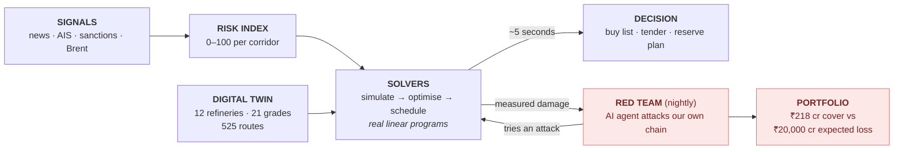

# Miro prompt — CHAKRAVYUH architecture (simple version)

**9 boxes, one loop, one strip.** Readable in about ten seconds from the back
of a room. Paste the block below into **Miro AI → Generate diagram**.

---

## PROMPT — copy everything between the lines

---

Create a simple technical architecture diagram titled
**"CHAKRAVYUH — from signal to executable plan in 5 seconds"**.

Use **one horizontal row of 5 boxes** as the main flow, left to right, with big
arrows between them:

1. **SIGNALS**
   News · Vessel AIS · Sanctions · Brent price
2. **RISK INDEX**
   Corridor Risk Index, 0–100 per shipping lane
3. **DIGITAL TWIN**
   12 refineries · 21 crude grades · 525 routes
   *small text:* which crude each refinery can actually process
4. **SOLVERS** ← make this box visually largest, it is the centrepiece
   Simulate the shock → optimise procurement → schedule the reserve
   *small text:* real linear programs, not a language model
5. **DECISION**
   Ranked buy list + draft tender + reserve plan

Label the arrow from box 4 to box 5: **"~5 seconds"**

**Below the main row**, add one box connected upward into box 4 with a
**two-way arrow loop**, drawn in red/coral:

- **RED TEAM (nightly)**
  An AI agent attacks our own supply chain to find weak points
  *small text:* the solvers score it, so it cannot exaggerate

- Label the arrow going up: **"tries an attack"**
- Label the arrow coming down: **"measured damage"**

**To the right of the red team box**, one more box connected to it:

- **PEACETIME PORTFOLIO**
  What to buy today so the attack hurts less
  *small text:* ₹218 crore of cover against ₹20,000 crore of expected loss

**Across the very bottom**, a thin full-width strip:

- **HONESTY LEGEND — every number is colour-coded by where it came from:
  live · curated · replayed · model output. Nothing simulated is ever shown
  as live.**

Style: clean and minimal, plenty of whitespace, rounded boxes, large readable
text, no icons or clip-art. Main flow in blue-grey. Red team loop in coral.
Honesty strip in light grey.

---

## END OF PROMPT

---

## Mermaid version (renders instantly in GitHub, Notion, or mermaid.live)

---

## How to talk to it (20 seconds)

> Signals come in on the left and become a risk score per shipping lane. That
> meets a digital twin that knows which crude each refinery can actually
> process. The solvers in the middle do the real work — they're linear
> programs, not a language model guessing — and five seconds later you have a
> buy list and a draft tender.
>
> The loop underneath is the interesting part: every night an AI agent attacks
> our own supply chain looking for weak points, and our own solvers score it,
> so it can't exaggerate. Whatever it finds turns into a shopping list of
> things to buy today.
>
> And the strip along the bottom means every number on screen tells you whether
> it's live, curated, replayed, or modelled.

---

## If you need the detailed version

The full five-layer diagram — every module, the CRI weighting, the LP
constraints, the mitigation ceiling — is in git history at commit `3ed27fc`
(`git show 3ed27fc:MIRO_PROMPT.md`). Use it for a technical appendix slide,
not the main architecture slide.
