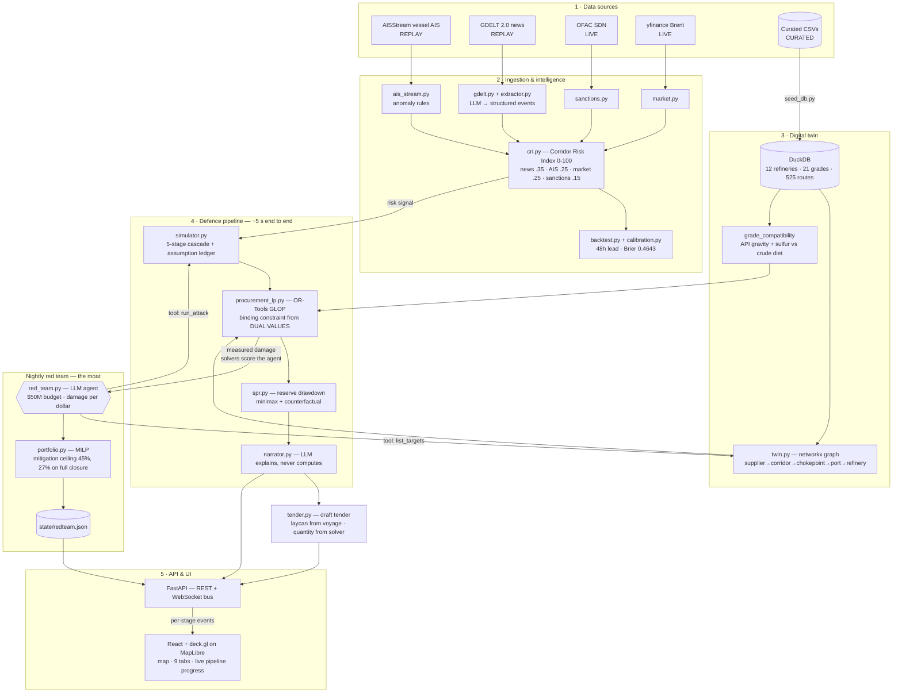

# Miro AI prompt — CHAKRAVYUH technical architecture

Paste the block below into **Miro AI → "Generate diagram"** (or Miro Assist →
Diagram). If your Miro plan lacks AI generation, the same text works in
Mermaid, Excalidraw AI, Eraser.io, or Napkin — and a hand-build guide follows
underneath.

---

## PROMPT — copy everything between the lines

---

Create a technical architecture diagram titled **"CHAKRAVYUH — Anticipatory
Energy Supply-Chain Resilience for India"**.

Lay it out as **five horizontal layers, top to bottom**, with a **vertical
band down the right-hand side**. Use rounded rectangles for components,
cylinders for data stores, and hexagons for AI agents. Label every arrow.

**LAYER 1 — DATA SOURCES (top row, 4 boxes side by side)**
Colour-code each box by data provenance and put the tag in the box:
- "AISStream — vessel AIS" · tag: REPLAY (no API key) · blue
- "GDELT 2.0 — news events" · tag: REPLAY (network blocked) · blue
- "OFAC SDN — sanctions" · tag: LIVE · green
- "yfinance — Brent BZ=F" · tag: LIVE · green
Add a fifth, offset box below-left: "Curated CSVs — refineries, suppliers,
routes, SPR, freight, tankers" · tag: CURATED · amber

**LAYER 2 — INGESTION & INTELLIGENCE (4 boxes)**
- "ais_stream.py — dark-vessel & anchorage anomalies"
- "gdelt.py + extractor.py — LLM event extraction to structured JSON"
- "sanctions.py — SDN delta, maritime designations"
- "market.py — Brent, volatility, freight proxies"
All four arrow down into one wide box:
- "cri.py — Corridor Risk Index (0–100 per corridor)"
  Sub-label: "weights: news 0.35 · AIS 0.25 · market 0.25 · sanctions 0.15;
  missing feeds renormalise, never scored as zero"

**LAYER 3 — DIGITAL TWIN (2 boxes side by side)**
- Cylinder: "DuckDB — 12 refineries, 21 grades, 525 routes, 3 SPR sites"
- Box: "twin.py — networkx knowledge graph
  supplier → corridor → chokepoint → port → refinery"
- Between them, a small box: "grade_compatibility view — API gravity + sulfur
  vs each refinery's crude diet"
Label the arrow from Layer 1's curated CSVs down to DuckDB: "seed_db.py".

**LAYER 4 — THE DEFENCE PIPELINE (the centrepiece — draw as a left-to-right
chain of 4 boxes inside a container labelled "run_defense_pipeline() — ~5 s
end to end")**
1. "simulator.py — deterministic 5-stage cascade
   supply gap → refinery runs → price → sector stress → GDP"
   Sub-label: "assumption ledger: every coefficient cited & slider-editable"
2. "procurement_lp.py — OR-Tools GLOP
   decision vars: barrels per supplier × refinery × vessel × week"
   Sub-label: "constraints: crude diet · liftability · tanker tonnage ·
   voyage time · berth capacity"
   Sub-label: "binding constraint read from LP DUAL VALUES"
3. "spr.py — OR-Tools reserve drawdown
   minimax rationing + end buffer, vs uncoordinated counterfactual"
4. "narrator.py — LLM explains solver output (never computes)"
Then one box to the right, outside the container:
- "tender.py — draft procurement tender: grade spec, laycan from voyage,
  quantity from solver, real pricing formula"

**LAYER 5 — API & UI (2 boxes)**
- "FastAPI — REST + WebSocket event bus"
- "React + deck.gl on MapLibre — map, 9 analysis tabs, live pipeline progress"
Arrow between them labelled "WebSocket: per-stage pipeline events".

**RIGHT-HAND VERTICAL BAND — ADVERSARIAL LOOP (draw as a distinct coloured
column spanning Layers 3–5, in red/coral)**
Title it "Nightly red team — the moat".
- Hexagon: "red_team.py — LLM agent, $50M budget, objective = damage per dollar"
- Two arrows from the hexagon pointing LEFT into the pipeline boxes, labelled
  "tool: run_attack" and "tool: list_targets"
- An arrow coming BACK from the pipeline to the hexagon labelled
  "measured damage — solvers score the agent, not its own claims"
- Below the hexagon: "portfolio.py — MILP over charter options, storage
  leases, term diversification, SPR expansion, refinery flex"
  Sub-label: "physical mitigation ceiling: max 45%, falls with severity —
  a total closure caps at 27%"
- Cylinder at the bottom: "state/redteam.json — persisted nightly artifact"

**CROSS-CUTTING BAR (thin horizontal strip across the very bottom)**
Label: "Honesty legend — every payload carries a provenance tag:
LIVE (green) · CURATED (amber) · REPLAY (blue) · SIMULATED (purple) ·
INJECTED (coral). Nothing simulated is ever presented as live."

**SELF-GRADING (small box attached to the CRI box in Layer 2, off to the side)**
- "backtest.py + calibration.py — June 2025 US–Iran replay:
  48-hour lead time, Brier 0.4643 (onset window 0.08)"

**KEY FLOW ARROWS to emphasise with thicker lines:**
- Data sources → CRI → "risk signal"
- CRI / Scenario / Stress test → Defence pipeline → "shock"
- Defence pipeline → UI → "executable plan in ~5 s"
- Red team ⇄ Defence pipeline → "self-play loop"

**Legend box (bottom-right corner):**
- Rounded rectangle = service/module
- Cylinder = data store
- Hexagon = AI agent (LLM in the loop)
- Green = live data · Amber = curated · Blue = replay · Purple = model output ·
  Coral = adversarial

Style: clean, technical, dark-on-light, generous whitespace, monospace for
file names. Avoid clip-art icons.

---

## END OF PROMPT

---

## If Miro AI output needs cleanup

Miro AI tends to flatten nested containers. After generating, do these four
fixes by hand — they carry most of the explanatory weight:

1. **Draw the red-team loop as an actual cycle.** The two arrows *into* the
   pipeline and one arrow *back out* are the whole point. If it renders as a
   dead-end box, the self-play story is lost.
2. **Keep the four pipeline stages in one visible container** with the "~5 s"
   label on the container itself. That's your stopwatch claim, visually.
3. **Make the honesty-legend strip span the full width.** It's cross-cutting,
   not a component.
4. **Bold the three phrases** judges should read even while skimming:
   "binding constraint from LP dual values", "solvers score the agent, not its
   own claims", and "a total closure caps at 27%".

## Speaker note for the architecture slide

> Three things to notice. The pipeline in the middle is deterministic — a real
> linear program, not a model guessing; the LLM only writes the explanation.
> The red column on the right is a closed loop: an agent attacks the same
> pipeline nightly and is scored by our own solvers, so it can't inflate its
> results. And the strip along the bottom means every number on screen carries
> its provenance — you can always tell what's live, what's replayed, and
> what's modelled.

## Fallback: Mermaid version

If you'd rather generate it as code, this renders in Mermaid Live Editor,
GitHub, or Notion:

